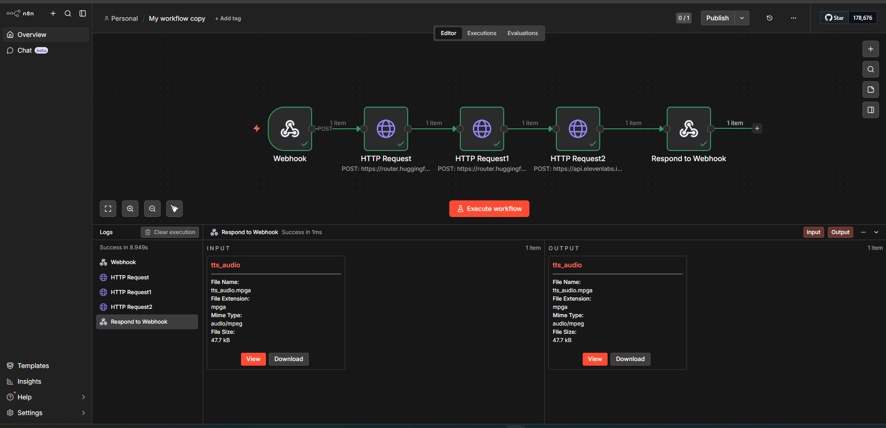
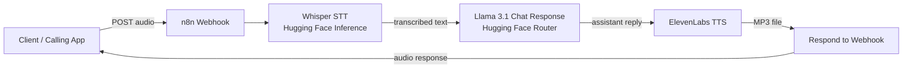

# AI Calling Bot Workflow for n8n


A production-style **n8n voice workflow** that receives audio through a webhook, transcribes it with **Whisper**, generates a concise phone-friendly reply with **Llama 3.1**, converts the reply to speech using **ElevenLabs**, and returns the generated audio file to the caller.

This repository is prepared for **GitHub upload** and has been sanitized so you can safely share the workflow structure without exposing live credentials.

---

## Overview

This workflow is designed for a simple AI calling or voice-assistant flow:

1. A client sends audio to an **n8n Webhook**.
2. The audio is forwarded to **Whisper Large v3 Turbo** for speech-to-text.
3. The transcribed text is passed to **Meta Llama 3.1 8B Instruct** for a short conversational reply.
4. The generated reply is sent to **ElevenLabs** for text-to-speech synthesis.
5. n8n returns the generated **MP3 audio** in the webhook response.

---

## Workflow Screenshot

This is the imported workflow running inside n8n:



---

## Architecture Diagram



### Node-by-node summary

- **Webhook**: receives the incoming audio payload.
- **HTTP Request**: sends audio to Whisper for transcription.
- **HTTP Request1**: sends transcript text to Llama 3.1 for a short reply.
- **HTTP Request2**: converts the reply text into speech using ElevenLabs.
- **Respond to Webhook**: returns the binary audio response (`tts_audio`).

---

## Included Files

```text
.
├── .env.example
├── .gitignore
├── README.md
├── assets/
│   └── workflow-screenshot.png
├── push_to_github.sh
└── workflow/
    └── calling-bot-workflow.json
```

---

## Stack

- **Automation:** n8n
- **Speech-to-Text:** openai/whisper-large-v3-turbo via Hugging Face Inference
- **LLM:** meta-llama/Llama-3.1-8B-Instruct
- **Text-to-Speech:** ElevenLabs
- **Transport:** HTTP Webhook + binary audio response

---

## Environment Variables

Set these values in your environment or map them through your n8n deployment:

```env
HF_API_KEY=your_huggingface_api_key
ELEVENLABS_API_KEY=your_elevenlabs_api_key
N8N_WEBHOOK_PATH=calling-bot-webhook
```

### Notes on secret handling

The workflow uses expressions instead of hardcoded keys:

- `Bearer {{$env.HF_API_KEY}}`
- `={{$env.ELEVENLABS_API_KEY}}`

If you prefer native **n8n credentials**, import the workflow and replace those header expressions with your configured credentials.

---

## How to Import and Run

### 1. Import the workflow

In n8n:

- Open **Workflows**
- Click **Import from File**
- Select `workflow/calling-bot-workflow.json`

### 2. Configure secrets

Add your API keys to the environment used by n8n, or convert the HTTP nodes to use n8n-managed credentials.

### 3. Review the webhook path

The sanitized workflow uses:

```text
calling-bot-webhook
```

Change it if you want a custom route.

### 4. Activate the workflow

Publish or activate the flow in n8n, then test it with an audio request.

---

## Request / Response Behavior

### Expected input

- **Method:** `POST`
- **Endpoint:** your n8n webhook URL
- **Payload:** audio file sent to the webhook

### Output

- Binary audio response returned through **Respond to Webhook**
- Output property: `tts_audio`
- Example output type: `audio/mpeg`

---

## Conversation Design

The assistant prompt is tuned for voice calls:

- replies should be short
- natural conversational tone
- no more than two sentences
- only one question at a time

This helps keep the generated speech suitable for phone interactions instead of chat-style long responses.

---

## Production Recommendations

Before using this in a real calling system, consider adding:

- input validation for audio format and size
- retry handling for API failures
- timeout control on external requests
- logging and observability
- rate limiting on the webhook
- fallback messages when STT or TTS fails
- a persistent memory or CRM integration if you want multi-turn customer flows

---

## Security

This repository has already been sanitized, but you should still:

- rotate any API keys that were present in the original export
- avoid committing real secrets in future workflow exports
- use environment variables or n8n credentials in production
- review workflow JSON before every public commit

---

## Push to GitHub

Use the helper script:

```bash
./push_to_github.sh https://github.com/YOUR_USERNAME/calling-bot-n8n.git
```

Or push manually:

```bash
git init
git add .
git commit -m "Initial commit - AI calling bot workflow"
git branch -M main
git remote add origin https://github.com/YOUR_USERNAME/calling-bot-n8n.git
git push -u origin main
```

---

## License

Add your preferred license before publishing publicly if you want others to reuse the project.
